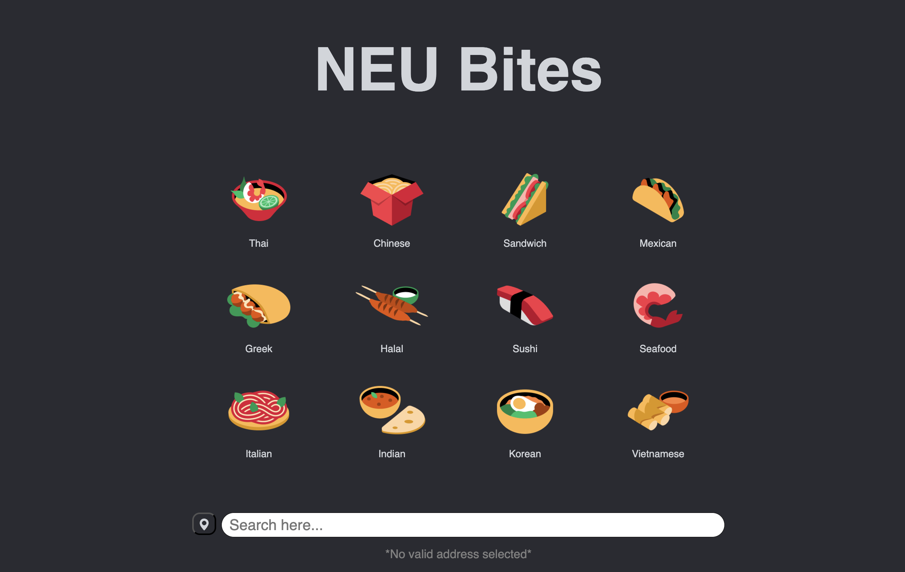

# NEU Bites

NEU Bites is a web application designed to help Northeastern University students discover nearby food options. By leveraging semantic search and a PostgreSQL database, the platform provides personalized dish recommendations based on user prompts.

## Features

- **Food Discovery**: Explore a variety of dishes and restaurants near Northeastern University.
- **Semantic Search**: Match user prompts to dishes using advanced vector-based search.
- **Database Integration**: GrubHub data is scraped and stored in a Supabase PostgreSQL database for fast and efficient querying.

## Tech Stack

- **Backend**: Flask, Supabase (PostgreSQL)
- **Frontend**: React.js
- **Programming Language**: Python (Backend), JavaScript (Frontend)
- **Data Processing**: GrubHub data scraping, pgvector extension for vector-based semantic search
- **Deployment**: AWS (Backend), Netlify (Frontend)

## Team
- Sathvik Charugundla
- Justin Iverson
- Ryaken Nakamato
- Nour Shoreibah
- Colin Wong

